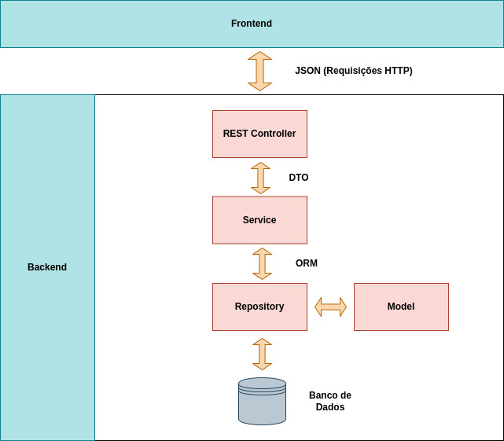
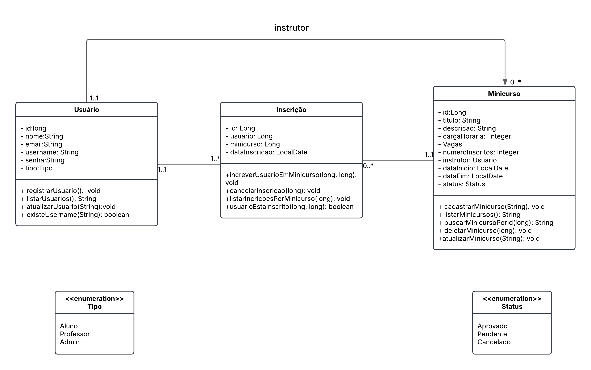

# Sistema-de-Gerenciamento-de-Minicursos

# Documentação do Projeto – Sistema de Gerenciamento de Minicursos

### **Sumário**
* [1. Resumo do Projeto](#1-resumo-do-projeto)
* [2. Requisitos do Sistema](#2-requisitos-do-sistema)
* [3. Regras de Negócio](#3-regras-de-negocio)
* [4. Arquitetura do Sistema](#4-arquitetura-do-sistema)
* [5. Stack Tecnológica](#5-stack-tecnologica)
* [6. Possíveis Melhorias](#6-possiveis-melhorias)
* [7. Links importantes](#7-links-importantes)

# Modelagem do Sistema
* [1. Diagrama de Caso de Uso](#1-diagrama-de-caso-de-uso)
* [2. Diagrama de Classes](#2-diagrama-de-classes)

# Documentação do Projeto – Sistema de Gerenciamento de Minicursos

## 1. Resumo do Projeto
O sistema permite que alunos cadastrem minicursos e atuem como instrutores, desde que aprovados por um professor. Professores validam os alunos interessados em lecionar, e outros alunos podem se inscrever nos cursos.

O MVP foca em um CRUD básico, garantindo requisitos essenciais, sem adicionar complexidades desnecessárias.

[voltar ao topo](#sumario)

## 2. Requisitos do Sistema
### 2.1 Requisitos Funcionais (RF)
#### 2.1.1 Gestão de Usuários
✅ RF-01 – O sistema deve permitir o cadastro de usuários como Aluno ou Professor.

✅ RF-02 – O sistema deve permitir autenticação dos usuários via matrícula e senha.

✅ RF-03 – O sistema deve permitir que os usuários visualizem seus próprios dados e atualizem algumas informações (exceto seu papel no sistema).

#### 2.1.2 Gestão de Minicursos
✅ RF-04 – O sistema deve permitir a criação de minicuros pelos usuários. O minicurso de um Instrutor fica pendente de aprovação ou rejeição.

✅ RF-05 – O sistema permite que Professores possam aprovar ou rejeitar a solicitação de um aluno que queira ofertar um minicurso.

✅ RF-06 – O sistema permite que usuários possam visualizar a lista de minicursos e seus respectivos instrutores.

#### 2.1.3 Gestão de Inscrições
✅ RF-07 – O sistema permite que alunos possam se inscrever apenas em minicursos **Aprovados**.

✅ RF-08 – O sistema deve listar minicursos disponíveis, incluindo status e data que as inscrições ficam abertas, número máximo de inscritos.

✅ RF-09 – O sistema permite consultar a lista de alunos inscritos em um minicurso.

✅ RF-10 – O sistema permite que alunos consultem em quais minicursos estão inscritos.

✅ RF-11 – O sistema deve permitir o cancelamento de inscrições.

✅ RF-12 – O sistema deve garantir que a capacidade máxima de alunos não seja ultrapassada.

✅ RF-13 – O sistema deve assegurar que os usuários não se increvam fora da data limite.

### 2.2 Requisitos Não Funcionais (RNF)
#### 2.2.1 Autenticação e Segurança
✅ RNF-01 – O sistema deve ser desenvolvido com Spring Boot e seguir princípios de arquitetura em camadas.

✅ RNF-02 – Deve utilizar Spring Security para garantir autenticação e autorização.

#### 2.2.2 Monitoramento
✅ RNF-03 – As métricas do sistema devem ser expostas via Spring Actuator.

✅ RNF-04 – As métricas devem incluir uso de memória, tempo de resposta e requisições por endpoint.

✅ RNF-05 – As métricas da API devem ser monitoradas via Prometheus e Grafana.

✅ RNF-06 – O tempo de resposta da API não deve exceder 500ms em 80% das requisições.

#### 2.2.3 Teste e Qualidade

✅ RNF-08 – Devem ser implementados testes unitários para validar regras de negócio, como aprovação de minicursos e controle de capacidade de inscrições.

✅ RNF-05 – O código deve seguir boas práticas de qualidade, com cobertura de testes monitorada pelo **JaCoCo**.

✅ RNF-06 – O sistema deve garantir pelo menos 80% de cobertura de testes.

#### 2.2.4 Persistência dos dados

✅ RNF-04 – A infraestrutura do banco de dados deve ser gerenciada pelo Flyway.

[voltar ao topo](#sumario)

## 3. Regras de Negócio (RN)

✅ RN-01 – Um Minicurso deve ter um título, descrição, instrutor e capacidade máxima de inscritos, data limite de inscrição e status.

✅ RN-02 – O status de um minicurso pode ser: Pendente, Aprovado ou Cancelado.

✅ RN-03 – Um Usuário (Aluno ou Professor) pode criar um Minicurso.

✅ RN-04 – Todo usuário pode participar como aluno de um minicurso.

✅ RN-05 – Se um Aluno cria um minicurso, ele inicia com o status PENDENTE e precisa de aprovação.

✅ RN-06 – Somente Professores podem aprovar ou rejeitar um aluno como Instrutor.

✅ RN-07 – Se um Professor cria um minicurso, ele já inicia com o status APROVADO.

✅ RN-08 – Usuários somente podem se inscrever em minicursos aprovados.

✅ RN-09 – Se um minicurso estiver lotado, o sistema não permite novas inscrições.

✅ RN-10 – Um minicurso pode ter inscrições abertas enquanto não tiver ultrapassado a data limite.

✅ RN-11 – Usuários podem visualizar os minicursos ativos.

✅ RN-12 – Um aluno pode cancelar a inscrição em um minicurso antes de seu início.

[voltar ao topo](#sumario)

## 4. Arquitetura do Sistema
### 4.1 Arquitetura Utilizada
O projeto segue uma abordagem de Arquitetura em Camadas, separando responsabilidades:

* **Camada Controller:** Manipula requisições e respostas da API.
* **Camada Service:** Contém regras de negócio.
* **Camada Repository:** Interage com o banco de dados via JPA.
* **Camada Security:** Garante autenticação e autorização via Spring Security.

[voltar ao topo](#sumario)

## 5. Stack Tecnológica

| Tecnologia | Uso no Projeto |
|---| ---|
| Spring Boot | Framework principal |
| Spring Web | Construção da API REST |
| Spring Security | Autenticação e autorização |
| Spring Actuator | Monitoramento de métricas |
| Spring Data JPA | Persistência de dados |
| H2 Database | Banco de dados em memória |
| Flyway | Controle de versão do banco |
| Thymeleaf | Renderização de páginas |
| JUnit + Mockito | Testes unitários e integração |

[voltar ao topo](#sumario)

## 6. Possíveis Melhorias Futuras
🔹 Adicionar Notificações para alertar alunos sobre aprovações e inscrições.

🔹 Implementar funcionalidade que permita alunos avaliarem instrutores.

🔹 Criar um Frontend separado com React/Vue para melhor experiência do usuário.

[voltar ao topo](#sumario)

## 7. Links Importantes
### 7.1 Documentação da API
Para visualizar endpoints da API, siga os passos:
* Clone o repositório do projeto na sua máquina;
* Abra o projeto usando uma IDE, de preferência o intelliJ IDEA. Obs: o prrojeto usa jdk 21
* Depois da aplicação iniciar (pode demorar 30s ou mais). Abra o link para acessar a documentação: http://localhost:8080/swagger-ui.html
* Use as credenciais **username =** huliane, **senha =** huliane123
* Clique no endpoint que deseja executar e aperte **Try out** e depois o **Execute**.
Lembre-se de informar os paramêtros requeridos no corpo da requisição

### 7.2 Banco de dados H2
O banco de dados pode ser acessado pelo link: http://localhost/h2-console/.

### 7.3 Taiga

Clique em **New Project** e o Importe arquivo do link no taiga:

https://drive.google.com/file/d/115tVTSdGCywRcSEZmKsFui4qyRBhIREz/view?usp=drive_link

# Modelagem do Sistema

## 1. Diagrama de Casos de Uso
### 1. 1 Atores do Sistema:

* Usuário → Pode se cadastrar, criar, se inscrever e visualizar minicursos. 
* Professor (usuário) → Aprova/rejeita instrutores e gerencia minicursos.  
* Sistema → Atua como mediador para controle de permissões e regras de negócio.

### 1.2 Casos de Uso Principais
#### 1.2.1 Gestão de Usuários
* **UC01 - Cadastrar Usuário** → Permitir que novos usuários se registrem no sistema.
* **UC02 - Login de Usuário** → Permitir que usuários façam login para acessar funcionalidades.
* **UC03 - Solicitar Permissão de Instrutor** → Alunos podem solicitar a função de Instrutor.

### 2.2.2 Gestão de Minicursos
* **UC04 - Criar Minicurso** → Permitir que um usuário crie um minicurso.
* **UC05 - Aprovar/Rejeitar Minicurso** → Professores podem validar minicursos criados por alunos.
* **UC06 - Listar Minicursos Disponíveis** → Usuários podem visualizar minicursos abertos para inscrição.
* **UC07 - Consultar Detalhes de um Minicurso** → Exibir informações de um minicurso específico.
* **UC08 - Listar Minicursos de um Instrutor** → Exibir todos os minicursos criados por um Instrutor.

### 2.2.3 Inscrição e Participação
* **UC09 - Inscrever-se em um Minicurso** → Permitir que um aluno se inscreva em um minicurso aprovado.
* **UC10 - Cancelar Inscrição em um Minicurso** → Permitir que um aluno cancele sua inscrição antes do início do curso.
* **UC11 - Ver Minicursos Inscritos** → Permitir que um aluno consulte os minicursos em que está inscrito.
* **UC12 - Listar Alunos Inscritos em um Minicurso** → Permitir que o instrutor visualize quem está inscrito em seu minicurso.

[voltar ao topo](#sumario)

## 2. Diagrama de Classes
Segue a modelagem das entidades e seus relacionamentos.

[voltar ao topo](#sumario)

